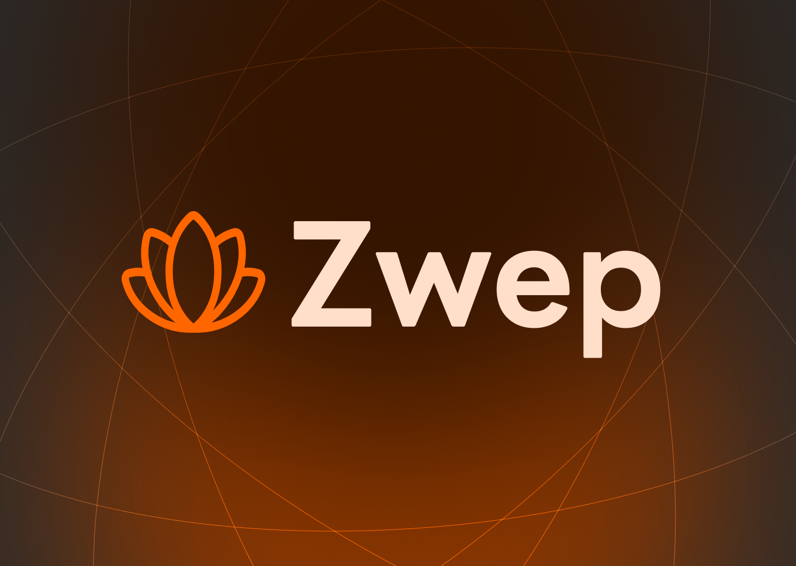

# Zwep

<p align="center">
  
</p>

> **A small, self-hosted search engine.** Zwep crawls a curated set of sources,
> builds its own search index, and serves fast, ranked, faceted results through a
> clean API. Clients — the cust*m Tab browser extension, a web UI, or any app —
> just query the API.
>
> Think of it as a private, brandable mini-Google for a universe of content you
> choose: e.g. **Gogure Media** articles, your own sites, or a whitelist of domains.

---

## What it is

- **Focused, not the whole web.** You define what gets crawled (`sources.yaml`).
- **Self-hosted & private.** Queries never leave your infrastructure.
- **Yours to rank.** Tune relevance, recency, facets, synonyms.
- **API-first.** One stable contract; the index engine can change behind it.

Zwep respects `robots.txt`, rate-limits itself, and identifies as `ZwepBot/1.0`.
It is **not** a general-purpose web scraper.

---

## How it works

```
seeds/sitemaps → Crawler → Queue → Renderer → Extractor → Indexer → Meilisearch
                                                                         │
                                              Search API (Fastify) ◀─────┘
                                                     │  REST / JSON
                                   cust*m Tab · Web UI · Admin Panel
```

- **Crawler** (Node + Playwright) — discovers & fetches whitelisted URLs.
- **Extractor** (Readability + metadata) — clean text, title, date, tags, lang.
- **Index** (Meilisearch; Elastic/OpenSearch optional) — fast, typo-tolerant.
- **API** (Fastify) — `/search`, `/suggest`, `/document/:id`, admin routes.
- **Web/Admin** (Next.js/Vite) — OpenAI-inspired search UI + source management.

Full detail in [`docs/architecture.md`](docs/architecture.md).

---

## Tech stack

| Layer | Choice |
|-------|--------|
| Language | TypeScript (Node LTS) |
| Crawl / render | Playwright (Chromium) |
| Extraction | @mozilla/readability + jsdom |
| Queue | BullMQ on Redis |
| Index | Meilisearch (adapter for Elastic/OpenSearch) |
| API | Fastify |
| Web / Admin | Next.js (App Router) or Vite + React |
| State DB | SQLite → Postgres |
| Deploy | Docker Compose |

---

## Quickstart

**Easiest (Windows):** double-click `start-dev.bat` in the project root. It checks
Node + Docker, starts Meilisearch/Redis, the API (`:8080`) and the web UI (`:5173`),
waits until the API is ready, and opens the browser. To stop, press any key in that
window (or just close it).

```bash
# 1. Clone & install
git clone https://github.com/philppplik/zwep zwep && cd zwep
npm install

# 2. Start infra (Meilisearch + Redis)
cp .env.example .env
docker compose up -d meilisearch redis

# 3. Configure your first source in config/sources.yaml
#    (name, seeds, allowedDomains, sitemap, schedule)

# 4. Start API + web UI together
npm run dev          # API :8080 + Vite :5173 (proxy → :8080)
#   or, on Windows, just double-click start-dev.bat

# 5. Open http://localhost:5173  and visit /admin to add sources / trigger crawls

# Search
curl "http://localhost:8080/v1/search?q=klimapolitik&source=example"
```

> **Why a 500 / ECONNREFUSED in /admin?** The Vite dev server proxies
> `/v1/*` to the API on port 8080. If the API isn't running (or you opened the
> built `dist/` without a backend), the admin console can't reach it. Always run
> `npm run dev` (or `start-dev.bat`) so both are up.


## Sources

Sources are curated (never a general web crawler). Two kinds:

- **`web`** (default) — seed URLs + `allowedDomains`; the crawler stays inside
  the whitelist, honours `robots.txt` + crawl-delay, dedups by canonical URL.
- **`google`** — a list of `queries` is run against Google; the organic result
  URLs are then crawled with the web crawler (no further link-following).

Manage sources via the admin console (`/admin`) or the admin API
(`/v1/admin/sources`). Defaults are seeded from [`config/sources.yaml`](config/sources.yaml)
into a writable store at `data/sources.json`.

> **Note on the Google source (fragile by design).** Google serves a
> JavaScript-only shell to non-browser clients and rate-limits datacenter IPs,
> so a plain HTTP fetch often returns **zero** organic links. The source is
> built to degrade gracefully (it reports `indexed: 0` instead of crashing) and
> will pick up results when run from an IP / setup Google doesn't block. For
> reliable results, put a search API or residential proxy behind it.

---

## Documentation

| Doc | What's inside |
|-----|---------------|
| [`docs/concept.md`](docs/concept.md) | Vision, why a private index, use-cases, scope |
| [`docs/architecture.md`](docs/architecture.md) | Components, data flow, storage, deployment |
| [`docs/design.md`](docs/design.md) | OpenAI-inspired design system (tokens, type, components) |
| [`docs/api.md`](docs/api.md) | REST endpoints, params, response & document schemas |
| [`docs/roadmap.md`](docs/roadmap.md) | Phased plan from docs → running engine |

---

## Project layout (planned)

```
Zwep/
├── docs/          # concept, architecture, design, api, roadmap
├── services/      # crawler, extractor, indexer, api
├── apps/web/      # search UI + admin (OpenAI design system)
├── packages/      # shared types, config
├── docker-compose.yml
└── .env.example
```

---

## Status

**Design phase.** All planning docs are written. Next milestone: *"one real site,
searchable, pretty"* — Phase 1 + Phase 2 for a single source (see the roadmap).

---

## Relationship to cust*m Tab

Zwep is a **separate, standalone project**. The [cust*m Tab](https://github.com/philppplik/custm-tab)
browser extension is just one possible client: it can offer "search Gogure" in its
dashboard by calling the Zwep API. Neither depends on the other's internals — only
the API contract in [`docs/api.md`](docs/api.md).

---

## License

MIT (planned).
